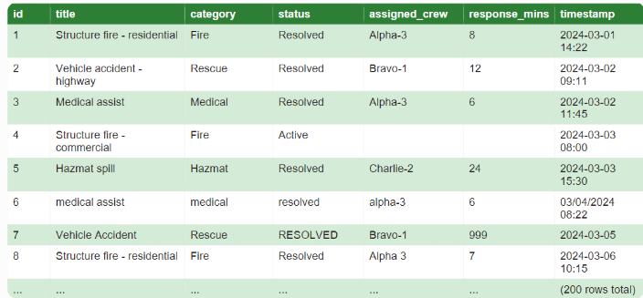

You are joining a team working with an emergency services client. They want a simple internal tool to log and review operational incidents. Data is currently logged in the format as seen in image.png in CONTENT A.

For the internal tool, it needs to be able to 1. log and therefore create incidents with a title, category and timestamp as a basic requirement. Data can be added in batch - higher use case - or added individually - minor use case. 

The tool should 2. review and filter incidents. Therefore, as indicated by the image.png, read incidents as rows in the database and show it through a Swagger API. How incidents can be filtered needs to be decided. 

The tool then 3. should reflect changing status over time. Resolved and Active are the two current values used for status. 

With regards to the data for the tool at the moment, it has flaws such as varied use of capitalization, variation in timestamp formats, empty or unfilled fields and outlier response times (e.g. 999 mins). 

The first eight rows of data have been given but the a representative data of 200 rows needs to be generated. 

<<< START CONTENT >>>

<<< END CONTENT >>>